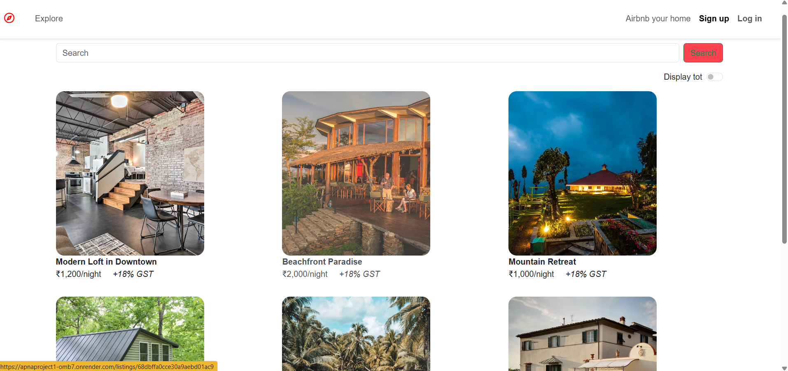
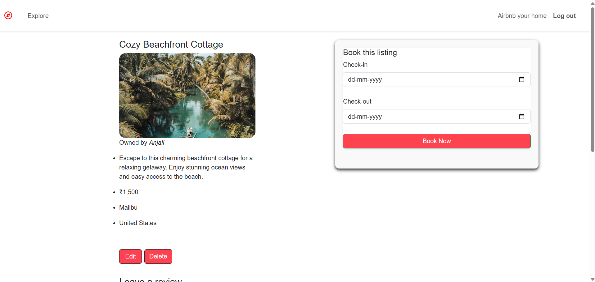
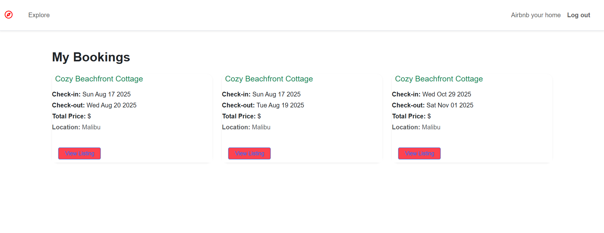

# 🏡 HomyWay

A full-stack *Airbnb-like property booking and management platform* built entirely with *Node.js* and *Express.js*, offering users a seamless experience to explore, list, and book homes — all from one integrated application.

**Live Website:** [Click here to visit HomyWay](https://apnaproject1-omb7.onrender.com/) 
---

## 📋 Table of Contents
- [Overview](#-overview)
- [Problem Statement](#-problem-statement)
- [Dataset](#-dataset)
- [Tools and Technologies Used](#-tools-and-technologies-used)
- [Key Features and Insights](#-key-features-and-insights)
- [Model / Output](#-model--output)
- [How to Run This Project](#-how-to-run-this-project)
- [Result and Conclusion](#-result-and-conclusion)
- [Future Work](#-future-work)
- [Author and Contact](#-author-and-contact)

---

## 🧭 Overview

*HomyWay* is a web-based platform designed to simplify the process of finding, listing, and booking properties online.  
Inspired by Airbnb, the project provides core functionalities such as user authentication, property listings, image uploads, booking dates, and a detailed view for each stay — all implemented using *server-side rendering with Node and Express*.

The main goal of *HomyWay* is to give users a *smooth, full-stack booking experience* without relying on frontend frameworks.

---

## ❓ Problem Statement

Existing platforms like Airbnb are complex and depend on large tech stacks.  
This project aims to *recreate the essential Airbnb experience* using a *minimal stack (Node.js and Express)* to demonstrate how powerful server-side rendering and RESTful design can be — even without React or SPA frameworks.

---

## 🗂 Dataset

- The dataset consists of *user-generated property listings* stored in MongoDB.  
- Each listing includes:  
  - Property title, description, and address  
  - Price per night  
  - Owner (host) details  
  - Availability dates  
  - Uploaded images  

---

## 🧰 Tools and Technologies Used

| Category | Technology |
|-----------|-------------|
| *Backend* | Node.js, Express.js |
| *Database* | MongoDB (via Mongoose) |
| *Authentication* | JSON Web Token (JWT) |
| *Templating / View Engine* | EJS |
| *File Uploads* | Multer |
| *Environment Variables* | dotenv |
| *Hosting / Deployment* | Render / Railway / Localhost (as applicable) |

---

## 🔍 Key Features and Insights

- 🧑‍💼 *User Authentication:* Secure login and registration using JWT.  
- 🏠 *List a Property:* Hosts can upload property details and images.  
- 📅 *Booking System:* Users can select available dates and book their stay.  
- 🖼 *Dynamic Image Display:* Property photos rendered directly from uploads.  
- 🔍 *Property Details Page:* Each property has its own dedicated info page.  
- 📬 *Announcements / Notifications:* (If implemented) Updates from hosts or admins.  
- ⚙ *Server-side Rendering (SSR):* All pages rendered dynamically via Express.  
- 🧾 *RESTful Routes:* Clean, structured backend endpoints.

---

## 🖼 Model / Output

Screenshots of the working application:

| Page | Screenshot |
|------|-------------|
| 🏠 Listings Page |  |
| 🏘 Property Listings |  |
| 📅 Booking Page |  |

---

## 💻 How to Run This Project

1. *Clone the repository*
   ```bash
   git clone https://github.com/tenacious-coder/HomyWay.git
   cd place-pilot

2. *Install Dependencies*
   ```bash
   npm install

3. *Add environment variables*

   MONGODB_URL ="your_mongodb_connection_string_here"   

   JWT_SECRET= "your_jwt_secret_here"

4. *Run the server*
   ```bash
   npm start     


## 🏁 Result and Conclusion

The *HomyWay* platform successfully demonstrates a complete, production-level accommodation booking system built using *Node.js* and *Express* — without relying on frontend frameworks.

Key achievements:
- Secure authentication and user session management.  
- Fully functional property listing and booking system.  
- Integrated image uploads, date-based booking calendar, and responsive design.  
- Dynamic reviews and rating system for enhanced user interaction.  
- Efficient data handling with *MongoDB* and *Mongoose*.

*Conclusion:*  
HomyWay showcases how a fully functional, scalable, and responsive web platform can be developed entirely with backend-driven rendering, maintaining both performance and usability. It bridges the gap between simplicity and modern web functionality — ideal for real-world booking applications.

---

## 🚀 Future Work

- *1. Payment Integration:*  
  Add secure online payment support using *Razorpay* or *Stripe* for seamless booking transactions.

- *2. Real-Time Notifications:*  
  Integrate *Socket.io* for instant updates on bookings, messages, and status changes.


- *3. AI-Powered Recommendations:*  
  Suggest personalized stays based on previous searches, bookings, and reviews.


- *4. Email & SMS Alerts:*  
  Send booking confirmations, cancellations, and updates using *Nodemailer* or *Twilio*.

---

## 👩‍💻 Author and Contact

*Author:* Anjali Kumari  

- 📧 *Email:* [anjalikumari70996@gmail.com](anjalikumari70996@gmail.com)  
- 🔗 *LinkedIn:* [linkedin.com/in/anjali-kumari-410264250](https://www.linkedin.com/in/anjali-kumari-410264250)  
- 💻 *GitHub:* [github.com/tenacious-coder](https://github.com/tenacious-coder)

---